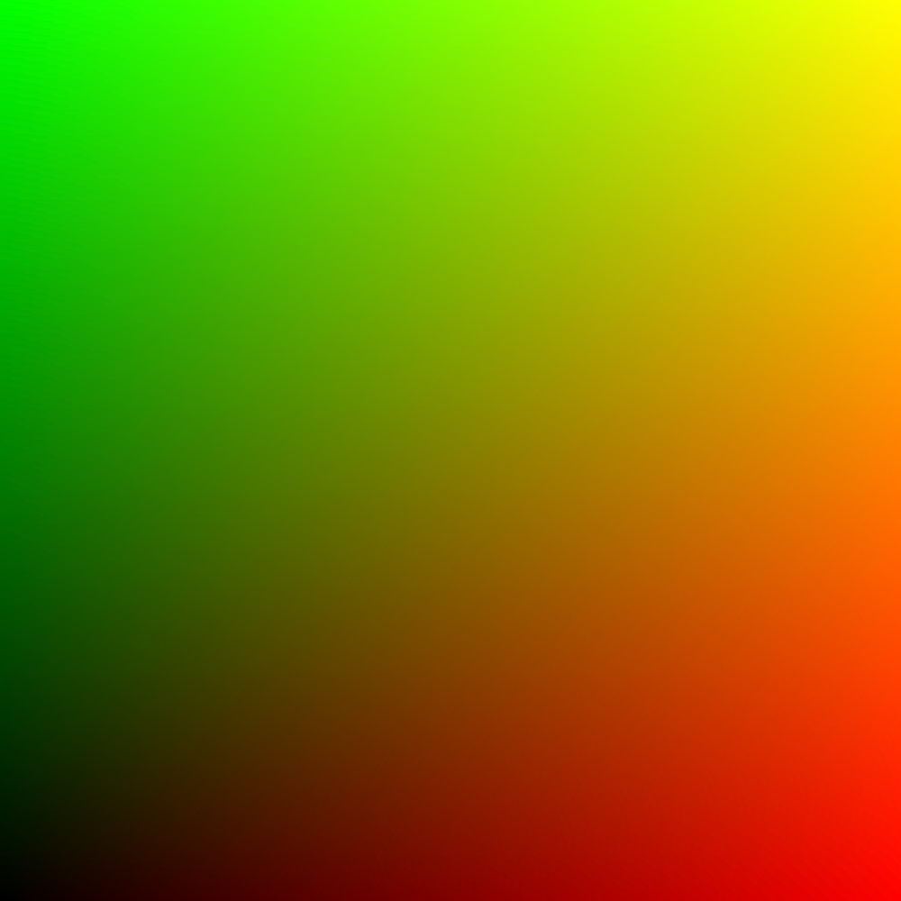

# wgsl-canvas

Simple way to run WebGPU shaders on HTML Canvas.

## Install

To install, run:

```sh
npm i --save-exact @wgsl-canvas/core
```

### With TypeScript (Recommended)

If you're using [TypeScript](https://www.typescriptlang.org/), it would be helpful to add [@webgpu/types](https://github.com/gpuweb/types), so your codebase will be aware of WebGPU-related types. 

To install them, run:

```sh
npm i --save-dev @webgpu/types
```

Then add them into your `tsconfig.json`:

```jsonc
{
  // ...
  "compilerOptions": {
    // ...
    "types": ["@webgpu/types"]
  }
}
```

## Get started

Here's the base example for you to get started:

```ts
import { WGSLCanvas } from "@wgsl-canvas/core";

// 1. Check WebGPU support
if (!WGSLCanvas.isSupported()) {
  alert("WebGPU is not supported in this browser");
  return;
}

// 2. Create a canvas
const canvas = document.createElement("canvas");
canvas.width = 500;
canvas.height = 500;
document.body.appendChild(canvas);

// 3. Create an instance of "WGSLCanvas" and initialize it
const wgslCanvas = new WGSLCanvas({ canvas });
await wgslCanvas.init();

// 4. Make your first render
wgslCanvas.render();
```

If everything is set up correctly, you should see this picture (which is the default fragment shader located under `WGSLCanvas.SHADER_FRAGMENT_DEFAULT` static field):



### Passing uniforms

To pass uniforms to your shader, you should first define them in `uniformsKeys` array in your `WGSLCanvas` instance:

```ts
wgslCanvas.uniformsKeys = ["time", "color1", "color2"];
```

Then, you can pass the values in `uniforms` object:

```ts
wgslCanvas.uniforms.time = 0.0;
wgslCanvas.uniforms.color1 = [1.0, 0.0, 0.0];
wgslCanvas.uniforms.color2 = [0.0, 0.0, 1.0];
```

Then, they'll be available under `var<uniform>` object at `@group(0)`, `@binding(0)` in your WGSL shader:

```wgsl
@group(0) @binding(0) var<uniform> uniforms: Uniforms;

struct Uniforms {
  time: f32,
  color1: vec3<f32>,
  color2: vec3<f32>,
}
```

> [!IMPORTANT]  
> The order of keys in `struct Uniforms` must be the same as defined in `uniformsKeys` array!

See full example here:
- [apps/examples/src/examples/Example01Uniforms.ts](./apps/examples/src/examples/Example01Uniforms.ts)
- [apps/examples/src/examples/Example01Uniforms.wgsl](./apps/examples/src/examples/Example01Uniforms.wgsl)

### Passing textures

Make sure you have your texture file served under some URL (can be absolute or relative).

Then, you can load it via `WGSLCanvas.loadTexture` static method to get an `ImageBitmap` image:

```ts
const textureUrl = "https://example.com/YOUR_TEXTURE.jpg";
const texture = await WGSLCanvas.loadTexture(textureUrl);
```

Then, pass it into `textures` array of your `WgslCanvas` instance:

```ts
wgslCanvas.textures = [texture];
```

In WGSL shader, it'll appear under the following vars:

```wgsl
@group(0) @binding(0) var texture_sampler: sampler;
@group(0) @binding(1) var texture: texture_2d<f32>;
```

> [!NOTE]  
> If you have uniforms, they'll appear at `@binding(0)`, but `sampler` and `textures` will appear under their bindings incremented by 1.

See full example here:
- [apps/examples/src/examples/Example02Texture.ts](./apps/examples/src/examples/Example02Texture.ts)
- [apps/examples/src/examples/Example02Texture.wgsl](./apps/examples/src/examples/Example02Texture.ts)

## Examples

See various examples at [apps/examples/src/examples](./apps/examples/src/examples).

To run them live, you can clone this repository, install dependencies via `npm install` and then run 

```sh
npm run dev
```

which will open the dev server at http://localhost:5173 by [Vite](https://vite.dev/).

## API

Check out auto-generated docs here: [tsdocs.dev:@wgsl-canvas/core](https://tsdocs.dev/docs/@wgsl-canvas/core)

## Version history

See [CHANGELOG.md](./CHANGELOG.md)
